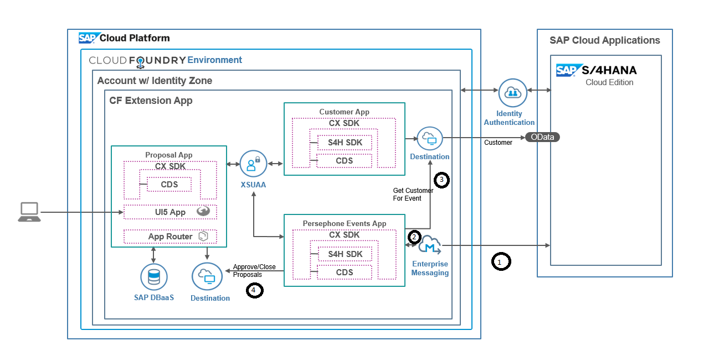

# persephone_event

## Description
This app enables user to subscribe for specific queue of enterprise messaging service and process events. 

[Enterprise Messaging Service](https://wiki.wdf.sap.corp/wiki/display/CoCo/Enterprise+Messaging+on+SAP+CP+CF+-+Getting+Started) available in SAP Cloud Platform CF enables users to implement event-driven architecture.Key features of messaging service are - 
1. Java API to send and recieve events. 
2. Native integration with S4Hana to fire events from S4Hana and consume same in SAP cloud platform

Below app can be used to implement message broker pattern between two microservices or it can be used along with Persephone app [CustomerService](https://github.wdf.sap.corp/SolutionPioneering/persephone_customer) and [ProposalService](https://github.wdf.sap.corp/SolutionPioneering/persephone_customer) for below shown scenario

  

# Table of Contents
* [Pre-requisitie](README.md#1pre-requisitie)
* [Setup](README.md#2project-setup)
* [Running Application](README.md#3running-application)
* [Code Walkthrough](README.md#4code-walkthrough)
* [Contribution Guide](README.md#5contributing)
* [Optional](README.md#6optional)
* [Videos](README.md#7videos)

# 1.Pre-requisitie
## Create new messaging instance
1. Login to the Cloud Foundry trial account : https://account.hanatrial.ondemand.com/cockpit#/home/trialhome
2. Click on 'Cloud Foundry Trial' to go to the Cloud Foundry Global Account.
3. Click on 'trial' to go to the trial sub-account.
4. Click on 'spaces' and select your space
4. In the Left pane, expand 'Service Marketplace' below Services
5. Select 'Enterprise Messaging' tile
6. Go to Instances
7. Click on new instance
8. In new instance wizard , for specify parameters  , specify below json
  {"emname": "messaging-prod"}
9. In confirm also give same name
10. Open dashboard for new instance from actions column
11. Select 'Queues' from left pane in dashboard and create new queue with name - "Persephone_Queue"

## Connect Services
* Create new destination service instance
* Open cloud platform subaccount page
* Select destination from left pane
* Add new destination for proposal service with name - "ProposalService"
    * Select authentication type - No Authentication
    * Enter URL for proposal service
    * Save
    * Check connection
* Add new destination for customer service with name - "CustomerService"
    * Selct authentication type - No Authentication
    * Enter URL for customer service
    * Save
    * Check connection
* Note:- Destinations should be defined at subaccount level( outside space)


# 2.Project Setup
##  Get project sources in Web IDE 
1. Right click on workspace in your WebIDE 'Files' navigation view and select Git > Clone Repository
2. Specify this repo URL
3. Project should be imported and available in your workspace
4. Select project , right click and go to project settings and reinstall builder . Wait till installation is done , once installation is done , click save and close
5. Select project and perform build action using right click
6. If build is succesful it will generate MTA folder for your project in workspace
7. Navigate to mta file for your project in MTA folder and click on deploy. Select required CF space to deploy app

##  Get project sources local and deploy (Optional)
1. Use git clone \<project URL.git\>_ to download the zip of this project to a local folder. 
2. Navigate to 'eventconsumer' folder
3. Open a command window. 
4. Adapt application name and host    
5. Build the jar file using maven
    ```
    mvn clean install
    ```
6. Via console login to your account. eg. if working on Europe: 
    ```
    cf api https://api.cf.eu10.hana.ondemand.com
    cf login 
    ```
    >**Hint:** If you want to find out which target are you currently using:
    > ```
    >  cf target
    >  ```
7. Run the command **push** of the **CLI**:
    ```
    cf push
    ```
##  Create new project in WebIDE ( Optional)
1. Download and unzip source content to file system
2. Go to eventconsumer folder in local system , create a zip of src folder
3. Create new project of type MTA with name - "persephoneevent"
4. Add new module of type 'java' with name - 'eventconsumer'
5. Select subtype 'springboot' for java project
6. Replace pom.xml in eventconsumer folder with pom from local unzipped folder
7. Delete src folder in webide
8. In WebIDE , select 'eventconsumer' and then click on - "Import file or project" and select src.zip
9. Update manifest.yml file with entries from local manifest.yml at root folder level
  - Need to add depedencies under require tag
  - Add 'host' parameter
  - Add 'properties' to define queues mapping
  - Add resources
10. Click on project and perform Build action
11. MTA should be generated in MTA folder in web ide , click on deploy on MTA file to deploy

   
# 3.Running-Application
* Open Events APP - https://[cf app url deployed above]/messages
* Postman Setup
    * Import attached [postman collection](docs/Events_Demo.postman_collection.json) and try
* Send Messages
    * Update URL in postman request - 'Send Msg to Q persephone'
    * Click on send , if response is 202 ; message was sent to Q successfully.
    * Refresh events app and you should be able to see your message
    * Deploy above events app , with another host name too ; so that you can see message being recieved by multiple subscribers
* Testing Proposal and Customer Service Integration
    * Create Proposal In UI for Proposal APP with following data- "FirstName: Sangeetha , LastName: Jayakumar , Country: DE , City: Heidelberg"
    * Send event to above URL with following data- "{"EVENT_PAYLOAD":{"BUSINESSEVENT":"ZFEG8BpAHtiG88DMEgS0lw==","TIMESTAMP":20180227091016,"KEY":[{"BUSINESSPARTNER":"1000000"}]}}"
    * It will fetch BuPa with ID-1000000 from backend and if data matches will close proposal as duplicate ; in my30047 S4Hana system id-1000000 is available with above data   


# 4.Code Walkthrough
* Package com.example.demo - Main package which contains actual events subscription and handling ligic
    * DemoApplication is our base sprint application
    * MessageController hosts REST servlet with get and post message to send messages to queue or reads messages recieved 
    * MessageEvent is model to hold message
    * [MessageService](/event-consumer-app/src/main/java/com/example/demo/MessageService.java) is main event service class which subscribes to CF event service 
Below classes are for complete Persephone Events scenario to be used later -
* Package com.example.base.destination
    * [DestinationAccessor](/event-consumer-app/src/main/java/com/example/base/destination/DestinationAccessor.java) class is used to read destination data for your CF account
* Package com.example.base.utils
    * API Handler class is a wrapper over springframework http to fire get/post calls
* Package com.example.S4Hana
    * BaseEntity is model to hold common properties between Customer and Proposal
    * Customer is model to hold customer details
    * [CustomerAPIFacade](/event-consumer-app/src/main/java/com/example/s4hana/CustomerApiFacade.java) is facade to read customer details from S4Hana system using OData API and destinations
* Package com.example.S4Hana.proposal
    * Proposal is model to hold proposal details
    * [Proposal API Facade](/event-consumer-app/src/main/java/com/example/s4hana/proposal/ProposalAPIFacade.java) is used to work with REST apis exposed by proposal extension to compare proposal and close duplicate proposal


# 5.Contributing
Find the contribution guide here: [Contribution Guidelines](docs/CONTRIBUTING.md)

# 6.Optional
* Replication of data to SFSF
  * Please check branch 'sfsf-intgn' ; for replication of user/partner from S4Hana to SFSF
  * On BuPa creation event ; we fetch BuPa details and replicate same to SFSF
  * Application uses CPI SFSF adapter to connect and create data in SFSF
  * It is recommended best practice to keep 3rd party integration in one central place like CPI
  * E.g. in future CPI can be used to replicate data to multiple targets and not just to SFSF
  * Technically it is possible to directly call SFSF also
  * In future we will like to enhance same to perform replication in batches

* Resilience using Hystrix
  * Please check branch - 'resilience' on how to use Hystrix to make app resilient
  * APP use hystrix annotations to implement fallback and circuit breaker patterns 

* Multiple Consumers for Events
  * Please check branch - 'multi-consumers' on how to consume events across multiple consumers
  
# 7.Videos
* Demo recording for above is available here
  * [Connectivity from S4Hana to Enterprise Message Service](https://jam4.sapjam.com/groups/O1GnGq1JBbvajL09zJKI1V/documents/T7irmFwNRono6U5WVDBCZt/video_viewer)
  * [Events and Persephone APP Integration](https://jam4.sapjam.com/groups/O1GnGq1JBbvajL09zJKI1V/documents/YAMZ9BAGt0kohO7KYAaub4/video_viewer)
